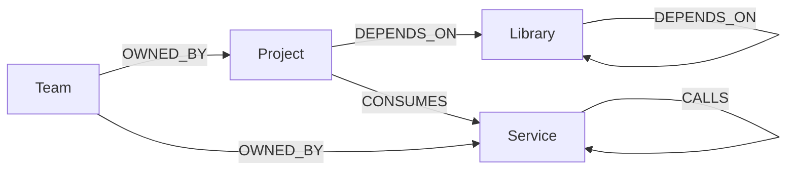
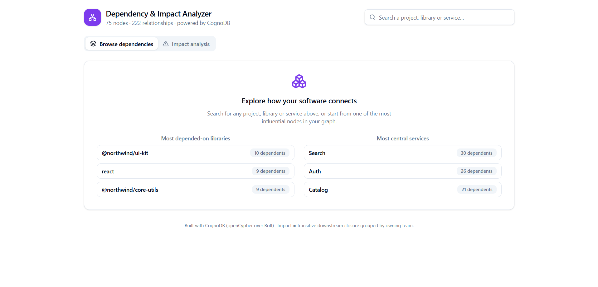
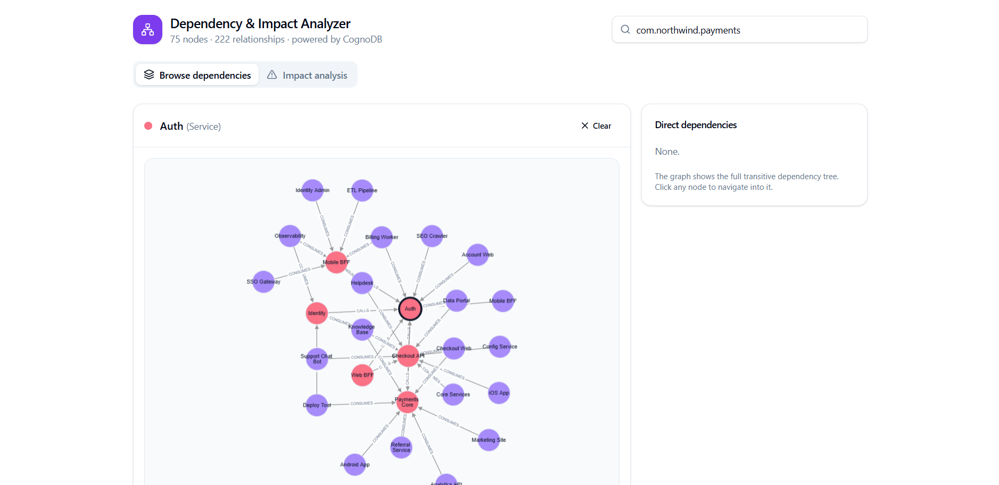
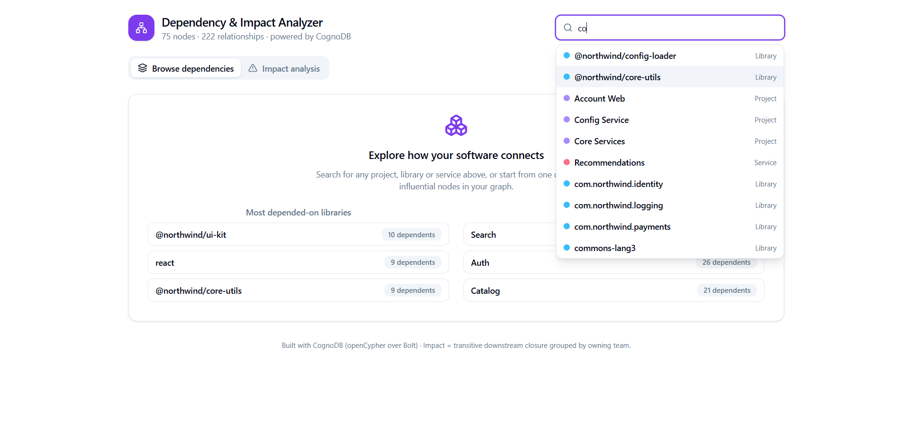

# Project Dependency &amp; Impact Analyzer

A small, complete web application backed by **CognoDB** — a managed graph database that speaks
openCypher over the Bolt protocol. It helps a non-technical person understand how a software
organisation's projects, shared libraries, running services and teams are connected, and — most
importantly — **what breaks when something changes**.

> Example: pick the shared `@northwind/core-utils` library and instantly see every project and team
> in its transitive blast radius. That question is the whole point of a graph database.

---

## 1. The use case

Modern software is a web of dependencies:

- A **Project** (a code repository) depends on many **Libraries** (npm/pip/maven/go packages).
- Libraries depend on other libraries.
- A deployed **Service** calls other services.
- Projects **consume** services.
- Every project and service is **owned by a Team**.

When a library ships a security fix (or a breaking change), an on-call engineer needs to answer,
fast:

> *"If I change (or take down) X, what downstream projects, services and teams are impacted?"*

A relational schema answers this with painful recursive `JOIN`s. A graph answers it with a single
multi-hop traversal. That is why this problem belongs to a graph database.

---

## 2. Why a graph database?

| Question | Relational (Postgres/MySQL) | Graph (CognoDB / Cypher) |
| --- | --- | --- |
| "Everything a project depends on, to any depth" | Recursive CTE + `JOIN` on a `dependencies` table | `MATCH (p)-[:DEPENDS_ON*1..5]->(m)` |
| "Everyone impacted if library X changes, grouped by team" | Recursive CTE **+** aggregation **+** client-side grouping | One `MATCH … <-[:DEPENDS_ON*1..5]- … WITH … OPTIONAL MATCH` |
| "Most central service in the org?" | Multiple self-joins / adjacency tricks | `size([(s)<-[:CALLS*]-(x) | x])` |

The relationships *are* the data model. Adding a new relationship type (e.g. `DEPLOYS_TO`) is a
schema-free change; in SQL it is a new junction table and a rewrite of every joined query.
Traversals are O(hops), not O(rows), so impact analysis stays fast as the graph grows.

**The "awkward for SQL" query** is the impact analysis (see `cypher/queries.cypher`, query #3):
a reverse transitive closure that is then aggregated by owning team. In SQL this forces a recursive
CTE whose result still has to be grouped by team in application code; in Cypher it is one
declarative statement.

---

## 3. Data model



| Node | Key properties | Example |
| --- | --- | --- |
| `Team` | `id`, `name`, `contact` | Platform Engineering |
| `Project` | `id`, `name`, `language`, `repoUrl`, `version` | Checkout Web |
| `Library` | `id`, `name`, `ecosystem`, `version` | @northwind/core-utils (npm) |
| `Service` | `id`, `name`, `environment`, `version` | Checkout API |

All relationships are typed and directed: `DEPENDS_ON`, `CONSUMES`, `CALLS`, `OWNED_BY`.

---

## 4. Architecture

```
dep-analyzer/
├── backend/                 # Node.js + Express + official Neo4j driver
│   ├── src/
│   │   ├── config.js        # reads COGNODB_* from environment
│   │   ├── db.js            # single driver instance, session-per-query
│   │   ├── queries.js       # all Cypher (parameterised)
│   │   ├── generator.js     # deterministic, realistic seed dataset
│   │   ├── seed.js          # idempotent MERGE load
│   │   └── server.js        # REST API + serves the built frontend
│   └── .env                 # COGNODB_URI / COGNODB_PASSWORD (git-ignored)
├── frontend/                # React + Vite + TypeScript
│   └── src/
│       ├── App.tsx          # browse + impact views, GSAP animations
│       ├── GraphView.tsx    # Cytoscape graph rendering
│       ├── api.ts           # typed fetch client
│       └── components/ui/   # shadcn/ui components (Button, Card, Tabs, …)
├── cypher/queries.cypher    # documented reference queries
└── README.md
```

**Stack choices**
- **Backend:** Node.js + Express, official Neo4j JavaScript driver (CognoDB is wire-compatible with
  Bolt 5.x / Cypher, so no custom SDK is needed). One driver instance is reused; each query opens
  and closes a session to stay far under the free tier's 200-connection limit.
- **Frontend:** React + Vite + TypeScript, styled with **shadcn/ui + Tailwind CSS v4**, graph
  visualised with **Cytoscape**, entrance animations with **GSAP** (`useGSAP`, auto-cleaned,
  respects `prefers-reduced-motion`).
 - **Single deploy:** the React UI is served as static assets and the Express API runs as a **Netlify
   Function** (see *Hosting* below) — so one Netlify site hosts both.

---

## 5. Setup &amp; run (local)

### 5.1 Create the CognoDB instance
1. Sign up at <https://console.cognodb.com/signup> (free tier, no card).
2. Create a free (`c0`) instance and copy the `bolt+s://…` URI and the generated password
   (shown once).

### 5.2 Configure secrets
```bash
cp .env.example backend/.env
# edit backend/.env and paste your COGNODB_URI and COGNODB_PASSWORD
```
The password is **never** committed — `backend/.env` is git-ignored.

### 5.3 Install, build, seed, run
```bash
npm run install:all     # install backend + frontend deps
npm run build           # build the React frontend into frontend/dist
npm run seed            # load the sample "Northwind" graph (idempotent)
npm start               # backend on :4000, serving the UI at http://localhost:4000
```
For development with hot reload, run `npm run dev:backend` and `npm run dev:frontend` in two
terminals (Vite proxies `/api` to `:4000`).

---

## 6. Main queries (see `cypher/queries.cypher`)

1. **Search** — `CONTAINS` match across all nodes for the autocomplete box.
2. **Multi-hop traversal** (`*1..5`) — the full transitive dependency tree of a project, and the
   full upstream closure of a service/library for the graph view. This is the required ≥2-hop query.
3. **Impact analysis** — reverse `*1..5` closure, `WITH m, min(length(rels))`, then
   `OPTIONAL MATCH (m)-[:OWNED_BY]->(t:Team)`. The transitive-closure-grouped-by-team query that is
   awkward in SQL.
4. **Highlights** — most-depended-on libraries and most-central services, powering the empty state.

All queries use driver parameters (`$id`, `$term`) — **no string-concatenated Cypher anywhere**.

---

## 7. Hosting (free tier)

Everything runs on a **single Netlify site**: the React UI is served as static assets and the
Express API runs as a **Netlify Function**. The function is produced by bundling
`netlify/functions-src/api.js` to CommonJS with esbuild during the build (CJS is required because
`serverless-http` does `require('http')`, which fails when bundled as ESM).

**Netlify (this repo is deployed here):**
- Build command: `npm run build`
  (installs backend + frontend deps, builds the UI, then bundles the function to
  `netlify/functions/api.cjs`)
- Publish directory: `frontend/dist`
- Functions directory: `netlify/functions`
- Add the three `COGNODB_*` environment variables (`COGNODB_URI`, `COGNODB_USER`,
  `COGNODB_PASSWORD`) in Site settings → Environment variables, scope `all`.
- `netlify.toml` contains the `/api/*` → `/.netlify/functions/api/:splat` redirect.
- Live demo: **https://dependency-impact-analyzer.netlify.app**

> Keep your CognoDB instance running until you hear back — the reviewer may query it live.

---

## 8. Screenshots & demo

The application is fully interactive; the snapshots below illustrate its main views.

**Landing / empty state**



The home screen prompts for a search and highlights the most depended-on libraries and most central
services, derived directly from the graph.

**Browse dependencies**



Selecting a node such as `@northwind/core-utils` draws its complete transitive dependency tree in the
graph, with the immediate dependencies enumerated in the side panel.

**Search autocomplete**



The search field offers live autocomplete across projects, libraries and services.

A short demo recording shows the end-to-end flow — search, dependency tree, then impact analysis
grouped by team: https://drive.google.com/file/d/16FlSP1Se65QPMOEXAJdQD6_tuKB7HeEk/view?usp=sharing

---

## 9. Notes

- **Free-tier aware:** the seed dataset is ~75 nodes / ~220 relationships, well within the `c0`
  limits (256 MB RAM, 1 GB disk, 200 connections).
- **Resilience:** if CognoDB is unreachable the API returns `503` with a friendly message and the
  UI shows a banner instead of crashing.
- **Idempotent seed:** `MERGE` on unique ids means `npm run seed` can be re-run safely.
- **CognoDB specifics:** uses openCypher over Bolt with the official Neo4j driver. Avoid
  Neo4j-only procedures; stick to core Cypher (as done here).
